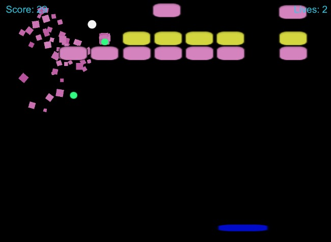
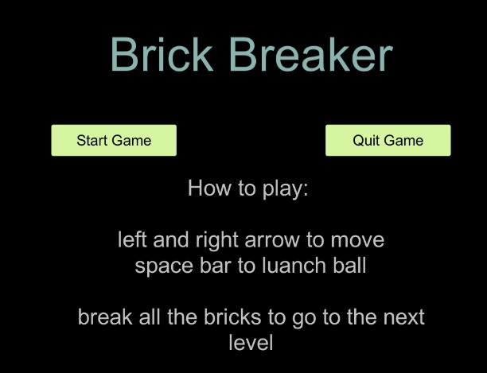
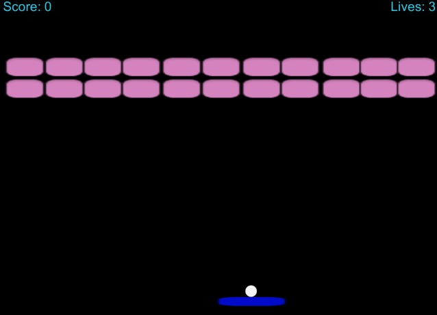
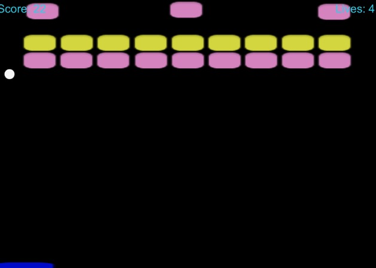
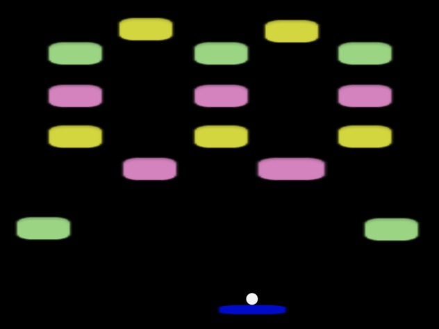

#  Brick Breaker game

lets play !!! The game at the following link-
https://michaly.itch.io/brick-breaker

**About**
You’re in control of a sliding platform that can bounce the wrecking balls into the bricks above. Use angles and rebounds to control the direction the balls move. If the balls fall into the abyss below, you’ll lose a life. Don’t forget to make the most of your power ups to reach new high scores!

**How to play**
Click Start Game to begin. Use your mouse to control the sliding platform. The ball will bounce in different directions based on where it hits the platform. Bricks need to be hit one to break.  Power ups may fall from bricks when they are broken. Collect them on the sliding platform. The game will end when you have lost balls to the abyss.
Which level can you reach?

**About the code**
Our code has the following elements:
- audio - Background and sound music when the ball hits the bricks.
- ball - Which works according to the laws of physics. **[ball script](https://github.com/michalkin9/Brick_Breaker-game/blob/master/Brick_Breaker/New%20Unity%20Project/Assets/Script/BallScript.cs)**
- sliding platform - that can be moved left and right and thus control where the ball will fly.**[paddle script](https://github.com/michalkin9/Brick_Breaker-game/blob/master/Brick_Breaker/New%20Unity%20Project/Assets/Script/PaddleScript.cs)**
- 3 levels - difficulty level increases
- Bricks - which are arranged differently at each level and when broken there is an animation of bricks breaking.
- menu - You can restart the game at the menu or return to the game if you are disqualified. You will also be shown whether you have been able to pass your highest score.) **[start menu script](https://github.com/michalkin9/Brick_Breaker-game/blob/master/Brick_Breaker/New%20Unity%20Project/Assets/Script/startMenu.cs)**

**about the levels**
The execution of the transition between the stages is done by using the array : 
public Transform[] levels; // contains all levels of the game 
This can be seen in the code of the **[game maneger script](https://github.com/michalkin9/Brick_Breaker-game/blob/master/Brick_Breaker/New%20Unity%20Project/Assets/Script/GameManager.cs)**
in the insector we chose the number of levels we want and chose the levels we wanted : 

